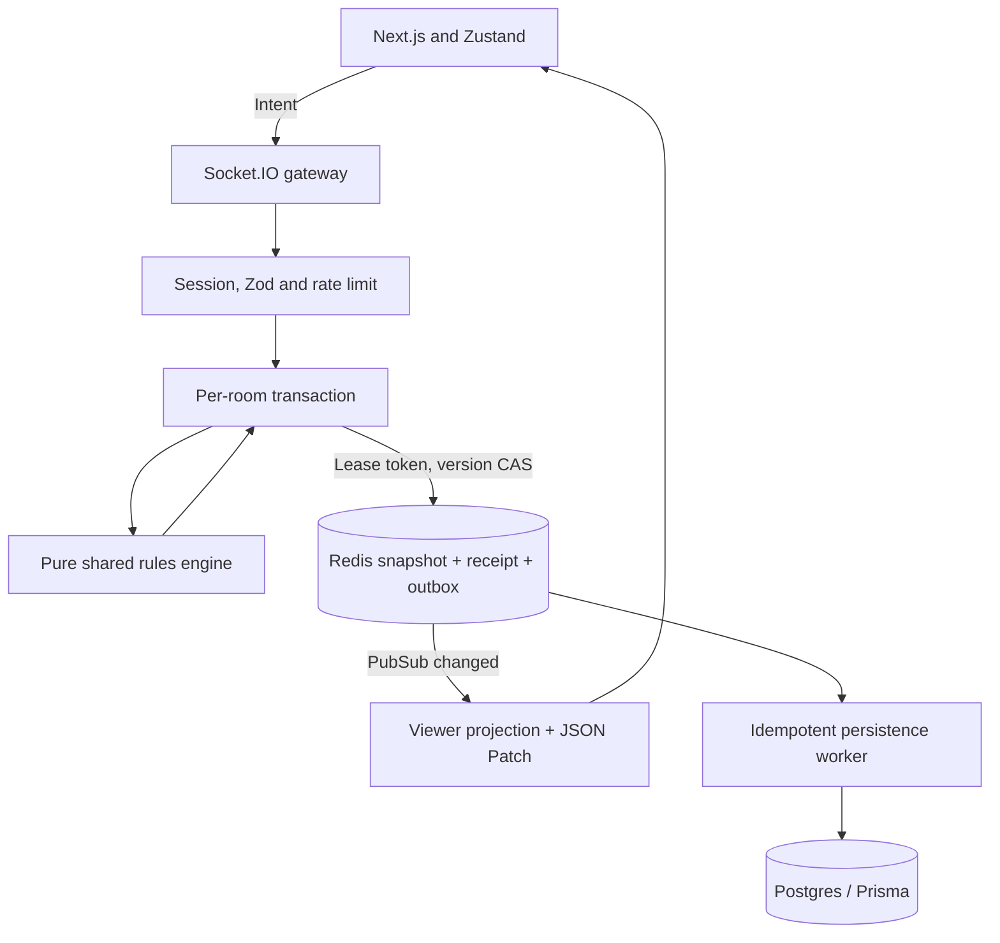

# Architecture

## Concurrency and failure boundaries

- Every game mutation, presence event and timer enters a per-room transaction.
- Memory adapter uses a FIFO promise chain for tests. Redis adapter uses a short renewable-by-next-command lease, unique token fencing and CAS. Transaction work is synchronous CPU-only engine execution; persistence outside Redis does not extend the room lease.
- A worker that pauses past the lease cannot commit even if another worker has acquired the room.
- Successful state, receipt and outbox append form one Lua transaction. No socket sees an uncommitted state.
- Publish can be lost after commit. A later change or SYNC_REQUEST recovers the latest snapshot. Browser ignores duplicate patches and checks sequence continuity.
- Outbox consumers process oldest entries, retry on Postgres errors and acknowledge only after a successful database transaction. Database uniqueness and row locking make repeated projection safe.
- Room deadlines survive process restart. Presence sweep detects vanished connections. The 90-second grace starts when disconnect is detected, which may be up to one sweep interval after a process crash.

## Deployment boundary

This deliverable is a local-first Node/Next monorepo, with a persistent Socket.IO server, Redis and Postgres. It is not a static Site, and no hosted URL is provisioned. Deploy web and server together behind an HTTPS proxy or separately with explicit allowed origins. Keep WebSocket connections enabled.

`packages/shared` contains deterministic domain code; importing it in the web app grants no server privileges. Rules are checked again at the server on every command. Currency is integer VNĐ, and user-entered values are bounded by Zod.

## Storage privacy

The internal state includes draw order, discard pile and player cards. Projection removes draw/discard and other players' hands; pending trades are visible only to participants. Publicly resolved cards still appear in the event log, as they do in a tabletop game. Session credentials are stored outside room state and hashed before storing in Redis.

## Deliberate implementation scope

No external payment, accounts/login UI, matchmaking ratings, AI purchase strategy, or room state sourced from client. JSON files are the balance source; v1 state carries their SHA-256 hash. Persistence is implemented but infrastructure tests require actual test Redis/Postgres endpoints; see verification.md.
